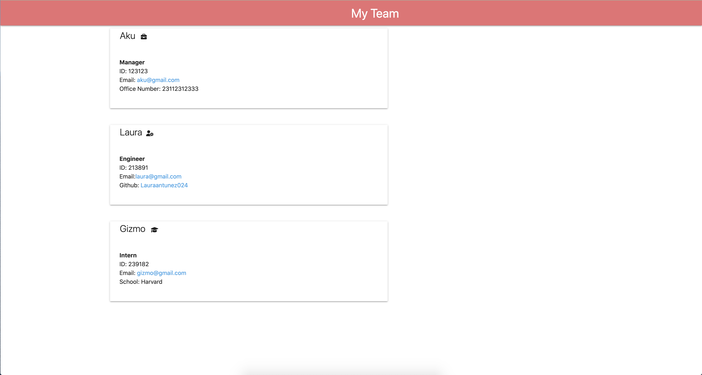

# Team-Profile-Generator

## Table of Contents

This project is cusing the MIT license. 
    
- [Description](#description)
- [Installation](#installation)
- [Usage](#usage)
- [Credits](#credits)
- [License](#license)
- [Contributing guidelines](#contributing)
- [Tests](#tests)
- [Questions](#questions)

## Description

Keeping track of teams as they expand is often an issue many growing companies find themselves in. With the team generator, someone can set up profiles for an intern, engineer, or manager. The generator creates an HTML file that displays the cards.
Managers accept Name, ID, Email, and office number
Interns accept Name, ID, Email, and School
and Engineers accept Name, ID, Email and github username

## Installation

Add the files to your local environment by git cloning into a folder. CD into folder and run `node index.js` from terminal.

## Usage
Answer prompts and once completed, a formatted HTML file with the different team members will appear in the dist folder. 

## Credits
Laura Antunez

## License
MIT 

## Contributing guidelines

Email me!

## Tests

Tests for Employee, Engineer, Intern, and Manager classes are in __ tests __ folder

## Questions

If you have additional questions, you can reach me here:

[Github Profile](https://github.com/lauraantunez024)

My Email: lauraantunez024@gmail.com

Link to deployed application or link to video to view:

https://www.loom.com/share/ebf96c9328f54d53870f154c9534d9ff
